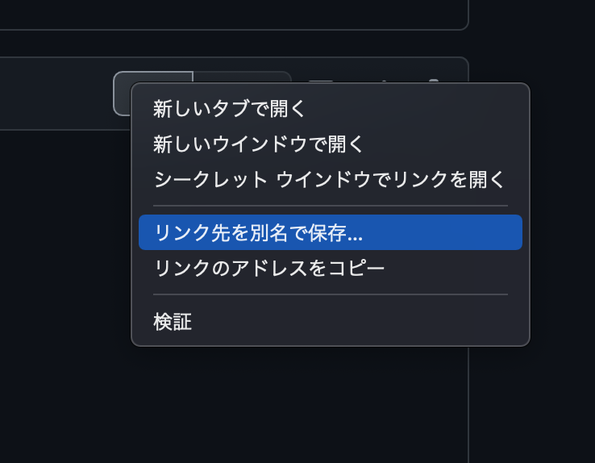
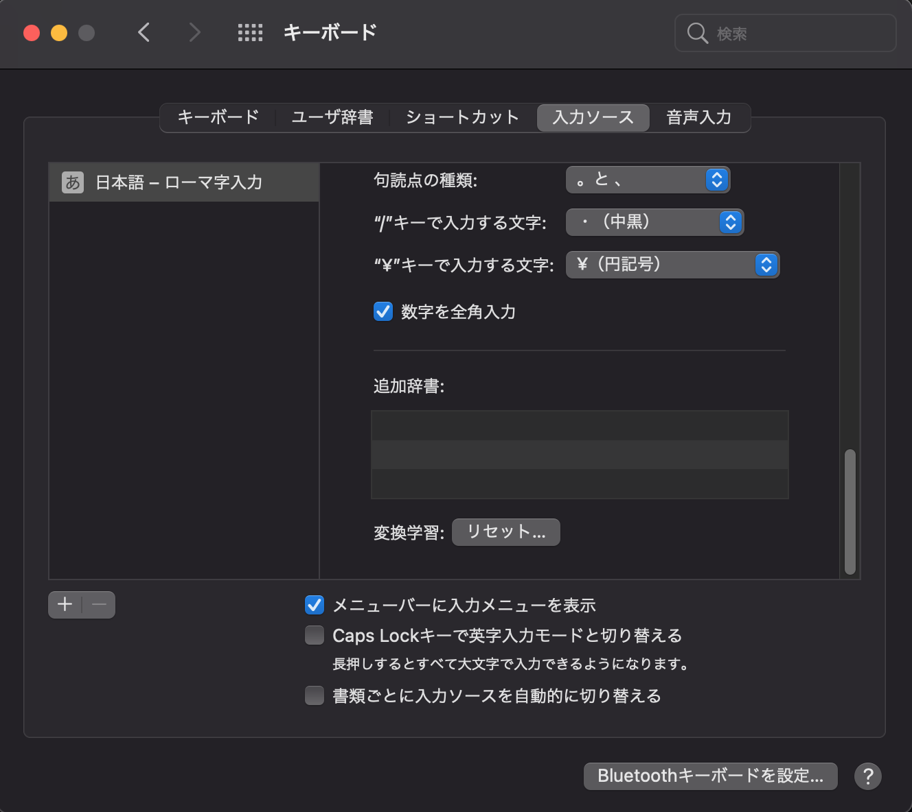
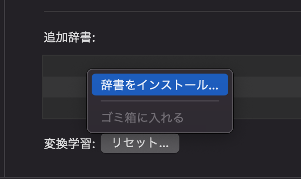
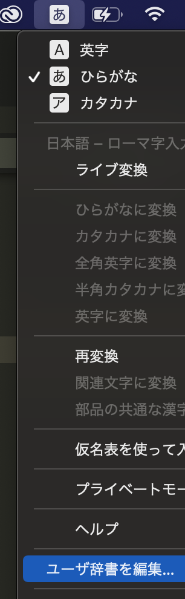

# macOSでの導入方法

## 1. 辞書データをダウンロード

好きな方を選んでRawボタンを右クリックして、コンテキストメニューから「リンク先を別名で保存」を選択します。

- [全量テキストファイル (mac-ime-dict--all.txt)](./dictionary/mac/mac-ime-dict--all.txt)
- [センシティブ系ハッシュタグを除いたテキストファイル (mac-ime-dict--all-no-sensitive.txt)](./dictionary/mac/mac-ime-dict--all-no-sensitive.txt)

## 2. キーボード設定の入力ソースを開く

1. 「システム環境設定」を開く
2. 「キーボード」を選択
3. 「入力ソース」タブを選択

## 3. ダウンロードしたテキストファイルを読み込ませる

次のいずれかの手段で登録します。

- 最初にダウンロードした`.txt`ファイルを「追加辞書」にドラッグアンドドロップ
- コンテキストメニューから「辞書をインストール」を選択し、最初にダウンロードした`.txt`ファイルを選択

### 重要：読み込みに失敗する場合

> 一致しない引用符のある行

現在調査中ですが、シングルクォートを含めることができないようです。

うまくいかない場合は、テキストファイル内で指摘された行から「`'`」を削除したあと、再度試してみてください。

シングルクォートが原因で登録できなかった単語は、ユーザ辞書から登録することもできます。
