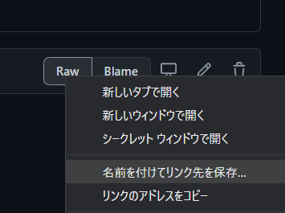
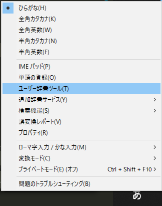

# Windows 10での導入方法

[toc]

## 1. 辞書データをダウンロード

好きな方を選んでRawボタンを右クリックして、コンテキストメニューから「名前をつけてリンク先を保存」を選択します。

- [全量テキストファイル (ms-ime-dict--all.txt)](./dictionary/win/ms-ime-dict--all.txt)
- [センシティブ系ハッシュタグを除いたテキストファイル (ms-ime-dict--all-no-sensitive.txt)](./dictionary/win/ms-ime-dict--all-no-sensitive.txt)

## 2. ユーザ辞書ツールを開く

タスクバーの言語バーを右クリックし、コンテキストメニューから「ユーザ辞書ツール」を開きます。

## 3. ダウンロードしたテキストファイルを読み込ませる

1. メニューバーから「ツール」を選択
2. 「テキストファイルからの登録」を洗濯
3. 最初にダウンロードした`.txt`ファイルを読み込ませます

読み込みに失敗する場合は、保存したファイルが次の仕様に準拠しているかをご確認ください。

- 文字コード - `UTF-16LE`
- 改行コード - `CTRL`